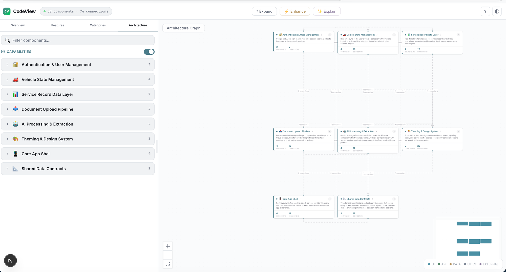

# CodeView

**Visual architecture companion for AI-powered coding tools** — see your codebase as an interactive graph, select components, and get plain-English explanations.

  

### Overview — AI-generated narrative with key features and stats


### Component Detail — description and AI explanation side by side


### Architecture Graph — interactive graph with slide-out detail panel


### Capability Lens — toggle to view architecture by reusable patterns


### Categories — all components grouped by technical layer


<details>
<summary>More screenshots</summary>

### Features — components grouped by business function


### Categories with Detail Panel


### Architecture Graph


### Search Palette (Cmd+K)


### Help Guide


</details>

---

## What It Does

CodeView scans any TypeScript/JavaScript project and turns it into an interactive architecture map. Non-technical product owners can see what's being built, understand how components connect, and get AI-powered explanations — all without reading a line of code. Use your existing Claude / Gemini CLI subscription, or run fully offline with Ollama.

- **Overview** — auto-generated narrative explaining what the app does, its features, data flows, and backend services
- **Features view** — components grouped by business function across all layers
- **Categories view** — components grouped by technical layer (UI, API, Data, Utils, External)
- **Architecture view** — interactive graph showing how layers connect
- **Capability lens** — toggle to regroup architecture by reusable patterns (auth, uploads, payments, etc.)
- **Explain** — click any component and AI reads the source code, then explains it in plain English
- **Enhance** — AI categorises and titles every component in your project
- **AI chat** — floating conversational assistant grounded in your codebase context (project-scoped history)
- **Folder picker** — load any project from a native folder dialog without restarting the server
- **Multi-AI support** — works with Claude Code, Gemini CLI, Ollama (local models), or any compatible AI tool
- **Runtime provider switching** — switch between AI providers via the settings gear, no restart needed
- **No separate API keys** — uses your existing AI terminal subscription, or run completely free with Ollama

### Privacy

- **Your code never leaves your machine directly** — CodeView itself is a local tool. Analysis data, enhancements, chat history, and all caches live in a `.codeview/` folder inside your project.
- **AI features inherit the provider's privacy model.** If you use Claude Code or Gemini CLI, file contents are sent to Anthropic or Google (same as any normal use of those tools). If you use **Ollama**, everything runs on your machine and nothing leaves your computer.
- **Want fully offline?** Pick Ollama in the settings gear. CodeView is then 100% local.

---

## Install It With Your AI Terminal

The fastest way to get CodeView running is to paste one of these prompts into your AI coding tool. It will handle the setup for you.

### Claude Code

```
I want to install and run CodeView to visualise my project architecture. Here's what to do:

1. Clone: git clone https://github.com/stonekey908/codeview.git
2. cd codeview
3. Run: pnpm install
4. Run: pnpm build
5. Then run: npx tsx apps/cli/bin/codeview.mjs /path/to/my/project

Replace /path/to/my/project with the actual path to the project I want to visualise.
Open the browser at the URL it shows (default http://localhost:4200).
If pnpm isn't installed, install it first with: npm install -g pnpm
```

### Gemini CLI

```
Clone and set up CodeView for me. Run these commands:
git clone https://github.com/stonekey908/codeview.git && cd codeview && pnpm install && pnpm build
Then run: CODEVIEW_AI_PROVIDER=gemini npx tsx apps/cli/bin/codeview.mjs /path/to/my/project
This will use Gemini as the AI backend instead of Claude.
```

### ChatGPT / Copilot / Other AI terminal tools

```
I want to set up CodeView (https://github.com/stonekey908/codeview). Steps:
1. git clone https://github.com/stonekey908/codeview.git
2. cd codeview && pnpm install && pnpm build
3. npx tsx apps/cli/bin/codeview.mjs /path/to/my/project

The core visualisation works without any AI. For AI features (Enhance, Explain, Overview),
CodeView auto-detects which AI CLI is installed (claude, gemini) or you can set
CODEVIEW_AI_PROVIDER=<cli-name> as an env var. It just needs any CLI that accepts a
text prompt and returns text output.
```

---

## Manual Setup

### Prerequisites

- **Node.js 20+**
- **pnpm** — install with `npm install -g pnpm` if you don't have it
- **An AI coding CLI** (optional — only needed for AI features):
  - [Claude Code](https://docs.anthropic.com/en/docs/claude-code) — `claude` command
  - [Gemini CLI](https://github.com/google-gemini/gemini-cli) — `gemini` command
  - Or any CLI that accepts a text prompt via `-p` flag

### Step by step

```bash
# 1. Clone the repo
git clone https://github.com/stonekey908/codeview.git
cd codeview

# 2. Install dependencies
pnpm install

# 3. Build all packages (required before first run)
pnpm build

# 4. Analyse your project
npx tsx apps/cli/bin/codeview.mjs /path/to/your/project

# Opens http://localhost:4200 with your architecture map
```

### Examples

```bash
# Analyse a Next.js project
npx tsx apps/cli/bin/codeview.mjs ~/projects/my-nextjs-app

# Analyse the current directory
cd ~/projects/my-app && npx tsx apps/cli/bin/codeview.mjs .

# Use a custom port
npx tsx apps/cli/bin/codeview.mjs ~/projects/my-app --port 3500

# Use Gemini instead of Claude for AI features
CODEVIEW_AI_PROVIDER=gemini npx tsx apps/cli/bin/codeview.mjs ~/projects/my-app

# Development mode
pnpm dev
```

---

## How AI Features Work

CodeView has two modes:

### Without AI (always works)
The core scanning, graphing, and navigation works with **zero AI setup**. You get:
- Full interactive architecture map
- All four navigation views (Overview structure, Features, Categories, Architecture)
- Component details, connections, source code viewer
- Search, keyboard shortcuts, resizable panels

### With AI (optional, uses your existing subscription)
The AI features (Enhance, Explain, Overview) call an AI CLI tool on your machine:

| Feature | What it does | Time |
|---------|-------------|------|
| **Enhance** | Reads every file (batches of 30), generates better titles, correct layer categorisation, one-sentence descriptions | 30-90s |
| **Explain** | Reads a single component's source, writes a detailed plain-English explanation | 5-15s |
| **Overview** | Reads the entire architecture, generates a narrative with features, data flows, backend | 30-60s |

**No separate API keys needed** — it uses whatever AI subscription you already have authenticated in your terminal.

### Supported AI providers

| Provider | Type | How to set up | Status |
|----------|------|---------------|--------|
| **Claude Code** | Cloud CLI | [Install Claude Code](https://docs.anthropic.com/en/docs/claude-code), sign in | Auto-detected |
| **Gemini CLI** | Cloud CLI | [Install Gemini CLI](https://github.com/google-gemini/gemini-cli), sign in with Google | Auto-detected |
| **Ollama** | Local HTTP | [Install Ollama](https://ollama.com), pull a model | Auto-detected |
| **Custom** | CLI | Set `CODEVIEW_AI_PROVIDER=/path/to/binary` | Manual |

CodeView auto-detects available providers. Switch between them at runtime using the **settings gear** in the toolbar — no restart needed. Your choice is saved per project.

### Ollama (local models — no tokens, no cost)

Run AI features entirely on your machine using Ollama. No API keys, no token costs, complete privacy.

**Setup:**

```bash
# 1. Install Ollama (macOS)
brew install ollama

# 2. Pull a model (recommended for code tasks)
ollama pull qwen2.5-coder:7b

# 3. Start Ollama (runs automatically on Mac, or:)
ollama serve
```

That's it. CodeView auto-detects Ollama when it's running. Click the **settings gear** in the toolbar to switch to it.

**Which features to use with Ollama vs cloud providers:**

| Feature | Ollama (local) | Claude / Gemini (cloud) | Why |
|---------|---------------|------------------------|-----|
| **Explain** | Use Ollama | Overkill | This is the big token saver. You'll click Explain dozens of times exploring a project. Each call is a single file — fast locally, no cost. |
| **Enhance** | Works well | Also fine | Runs once per project. Ollama handles it in smaller batches automatically. Cloud is faster but Ollama saves tokens. |
| **Overview** | Small projects only | Use cloud for large projects | Overview sends your entire project architecture in one prompt. Cloud models have massive context windows (200K+). Ollama models may truncate on projects with 80+ components — CodeView warns you if it won't fit. |

**Recommended approach:** Set Ollama as your default provider (via the settings gear). When you need to generate or regenerate an Overview on a large project, switch to Claude or Gemini for that one operation, then switch back. The settings gear makes this instant — no restart needed.

**Recommended Ollama model:** `qwen2.5-coder:7b` — fast, reliable JSON output, runs on any machine with 8GB+ RAM. Pull it with `ollama pull qwen2.5-coder:7b`.

### Switching providers at runtime

Click the **settings gear** icon in the top-right toolbar to:
- Switch between Claude, Gemini, and any installed Ollama models
- Adjust batch size for Enhance operations
- Regenerate all data or update only new components
- **Change project** — swap to a different codebase without restarting the server

Provider selection is saved per project in `.codeview/settings.json`. If you use Ollama for one project and Claude for another, each remembers your choice.

### Adding support for new AI tools

The AI integration is in `apps/web/src/lib/ai-provider.ts`. Two provider types:
- **CLI providers** — spawn a process with a prompt argument (Claude, Gemini pattern)
- **HTTP providers** — call a local API endpoint (Ollama pattern)

Pull requests for new providers welcome.

---

## Project Folder Picker

You don't need to restart CodeView every time you want to explore a different project.

- On the empty state (or via settings gear → **Change project...**), click **Browse folders** to open your OS's native folder picker (Finder on macOS, Explorer on Windows, zenity on Linux).
- Or paste an absolute path into the text input — `~` is expanded to your home directory.
- Recent projects are remembered in the browser's localStorage for one-click switching.

Under the hood this calls a local `POST /api/project` endpoint which runs the analyzer on the selected folder and writes `analysis.json` into that project's `.codeview/` directory.

---

## AI Chat

A floating chat widget in the bottom-right lets you ask questions about your codebase in plain English.

**How it works:**
- The chat always has your project's **Overview** and **Enhance** data in context — so it knows your app's summary, features, flows, capabilities, and every component's title and layer.
- When you mention a specific component, feature, or capability, CodeView automatically pulls in the relevant detailed description and graph connections. No manual context management.
- If you click a component in the graph, the chat treats it as "currently viewing" — if you then ask "what does this do?", it knows what you mean. But you can still ask anything else; it's just a hint.
- **History is saved per project** in `.codeview/chat-history.json`. Close the panel, switch projects, come back tomorrow — your conversation is still there. The trash icon clears it.
- The chat uses whichever AI provider is currently active (Claude, Gemini, or Ollama). Switch via the settings gear.

**Keyboard:** Enter to send · Shift+Enter for a new line · Esc to close the panel.

**Tip:** Ollama is a perfect fit for chat — it's local, free, and qwen2.5-coder:7b handles most questions in a few seconds.

---

## Navigation

| Tab | What It Shows | Best For |
|-----|--------------|----------|
| **Overview** | Narrative landing page — app summary, features, data flows | First-time understanding of a project |
| **Features** | Components grouped by business function (cross-layer) | Seeing how a feature works end-to-end |
| **Categories** | Components grouped by technical layer | Understanding the technical structure |
| **Architecture** | Interactive graph with connections between layers | Visualising data flow and dependencies |

## CLI Options

```
npx tsx apps/cli/bin/codeview.mjs [directory] [options]

Options:
  --port <number>   Port for the web server (default: 4200)
  --no-open         Don't open the browser automatically
  -h, --help        Show help

Environment:
  CODEVIEW_AI_PROVIDER   Force a specific AI CLI (claude, gemini, or /path/to/binary)
```

## What It Detects

| Framework | What's Detected |
|-----------|----------------|
| **React** | Components (JSX), hooks, contexts, forwardRef/memo |
| **Next.js** | Pages, layouts, API routes (App Router + Pages Router), middleware |
| **Database** | Prisma schemas, Drizzle tables, TypeORM entities |
| **Cloud Functions** | Firebase Functions, serverless handlers |
| **General** | Utilities, configs, service clients, constants, type definitions |

## Project Structure

```
codeview/
  apps/
    web/              # Next.js 15 visualisation app
    cli/              # CLI entry point
  packages/
    analyzer/         # File scanning + TypeScript parser + framework detectors
    graph-engine/     # Graph builder + clustering + labeler + layout
    prompt-builder/   # Context assembly for prompts
    watcher/          # File system watching (chokidar)
    mcp-server/       # MCP server for bidirectional AI integration
    shared/           # Shared TypeScript types
```

## Tech Stack

- **Monorepo:** pnpm + Turborepo
- **Web:** Next.js 15 (App Router), React Flow, Tailwind CSS v4, Zustand
- **Analysis:** TypeScript Compiler API, chokidar
- **AI:** Multi-provider (Claude Code, Gemini CLI, Ollama local models), Shiki syntax highlighting
- **Design:** shadcn Mist theme, Inter + JetBrains Mono, professional muted palette
- **Integration:** MCP SDK for bidirectional AI communication

## Data & Privacy

- **The CodeView app itself is local** — it runs entirely on your machine. No telemetry, no phone-home, no CodeView servers involved at any point.
- **Source code privacy depends on which AI provider you pick:**
  - **Claude Code / Gemini CLI** — when you run Enhance / Explain / Overview / Chat, file contents are sent to Anthropic or Google, same as any other use of those CLI tools. Their normal privacy terms apply.
  - **Ollama** — everything runs on your machine. Nothing leaves the computer. This is the only fully-offline option.
  - **No AI at all** — the core scanning, graph, navigation, and code viewer work with zero AI. Nothing is sent anywhere.
- **No separate API keys** — AI features use your existing terminal AI subscription, or run free locally with Ollama.
- **`.codeview/` folder** — all cached data (analysis, enhancements, descriptions, overview, chat history, settings) lives in a `.codeview/` folder inside your project. Add to `.gitignore` if preferred.
- **Read-only** — CodeView reads source files but never modifies your project.

## Development

```bash
pnpm install          # Install dependencies
pnpm dev              # Dev server
pnpm build            # Build all packages
pnpm test             # Run all 69 tests

# Individual package tests
pnpm --filter @codeview/analyzer test       # 25 tests
pnpm --filter @codeview/graph-engine test   # 29 tests
pnpm --filter @codeview/prompt-builder test # 6 tests
pnpm --filter @codeview/watcher test        # 5 tests
pnpm --filter @codeview/mcp-server test     # 4 tests
```

## Troubleshooting

### AI features don't work but the graph loads fine
The graph works without AI. Check that your AI CLI works: `claude -p "hello"` or `gemini -p "hello"`. If neither is installed, AI features won't be available but everything else works.

### "No AI CLI found"
Install one of: [Claude Code](https://docs.anthropic.com/en/docs/claude-code) or [Gemini CLI](https://github.com/google-gemini/gemini-cli). Or set `CODEVIEW_AI_PROVIDER=/path/to/your/cli`.

### No files found
CodeView scans for `.ts`, `.tsx`, `.js`, `.jsx` files. Point it at a directory with source code (not the root of a monorepo — use `apps/web` or similar).

### Port already in use
Use `--port` to pick a different port: `npx tsx apps/cli/bin/codeview.mjs . --port 3500`

### pnpm not found
Install it: `npm install -g pnpm`

---

## For AI assistants reading this README

If a user asks you to help them install CodeView, here's the sequence:

1. Check Node.js version: `node --version` (needs 20+)
2. Check pnpm: `pnpm --version` (install with `npm install -g pnpm` if missing)
3. Clone: `git clone https://github.com/stonekey908/codeview.git`
4. `cd codeview`
5. `pnpm install`
6. `pnpm build`
7. `npx tsx apps/cli/bin/codeview.mjs <path-to-user-project>`
8. The app opens at http://localhost:4200

For AI features, check which CLI is available:
- `which claude` — if found, AI features work automatically
- `which gemini` — if found, set `CODEVIEW_AI_PROVIDER=gemini` or it auto-detects
- If neither: AI features won't work, but the visualisation is fully functional without them

The `.codeview/` directory in the target project stores cached analysis. It can be deleted to force a re-scan. Add it to `.gitignore` if you don't want to commit it.

---

## License

MIT
