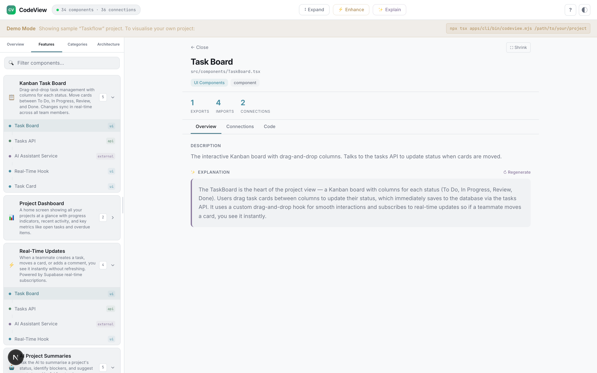
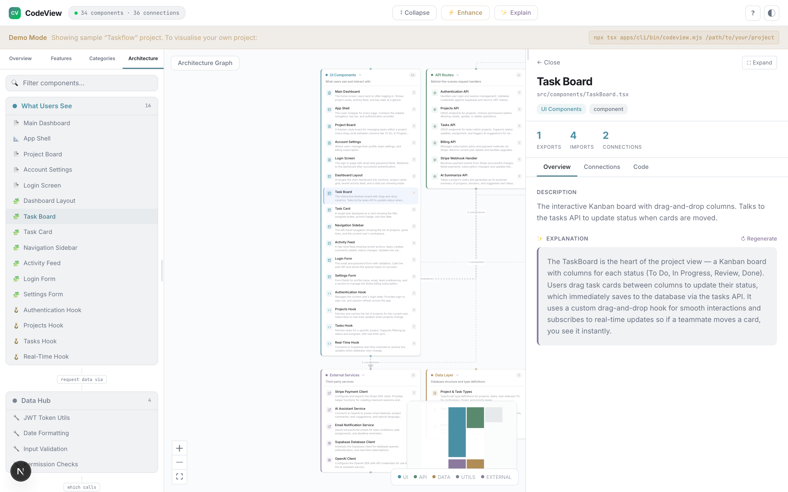
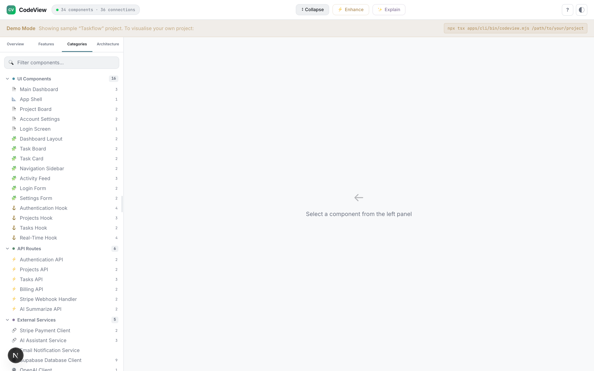
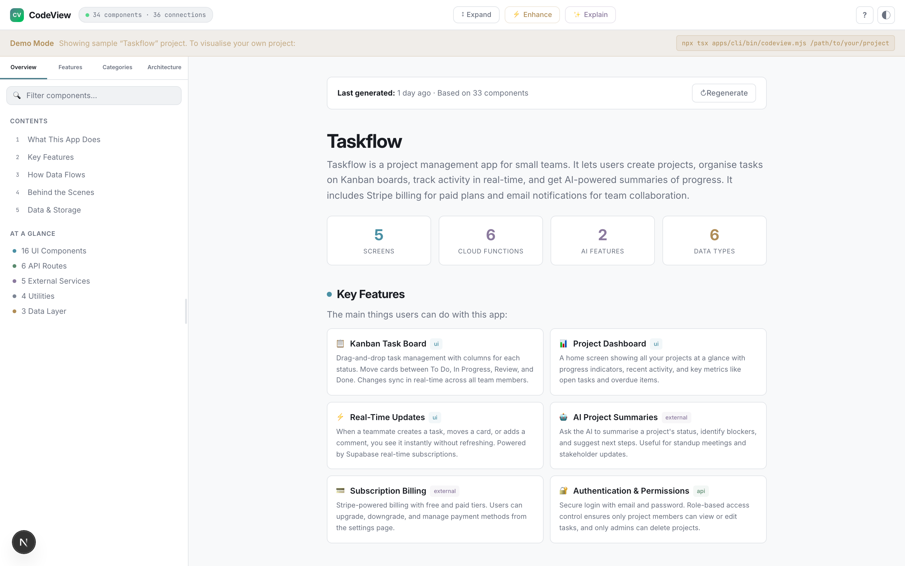
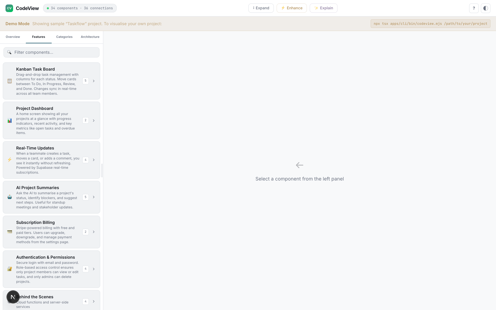
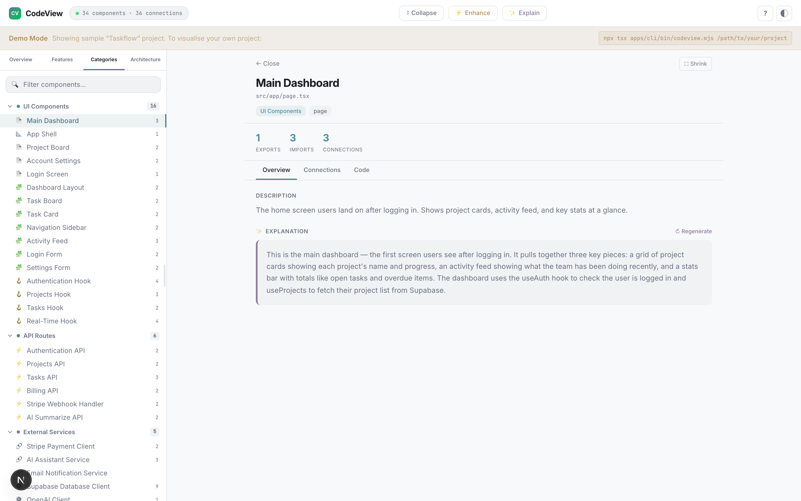
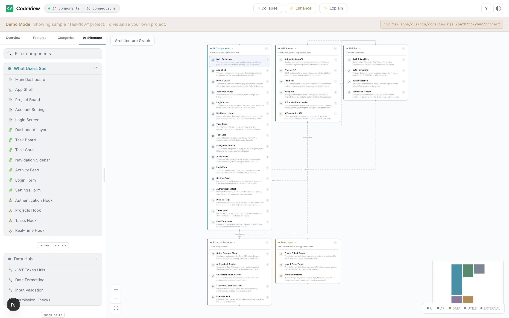
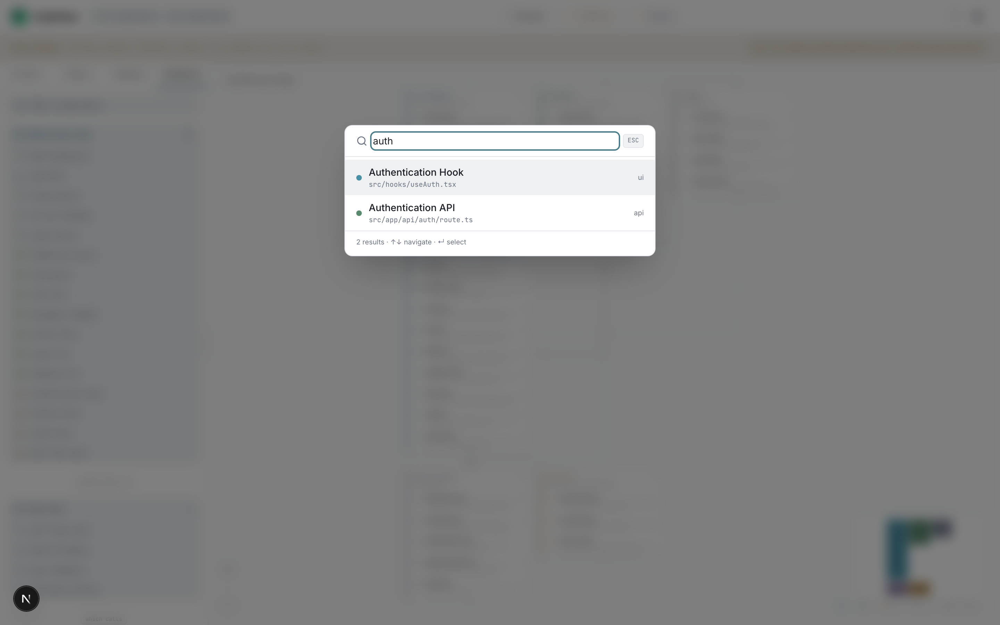
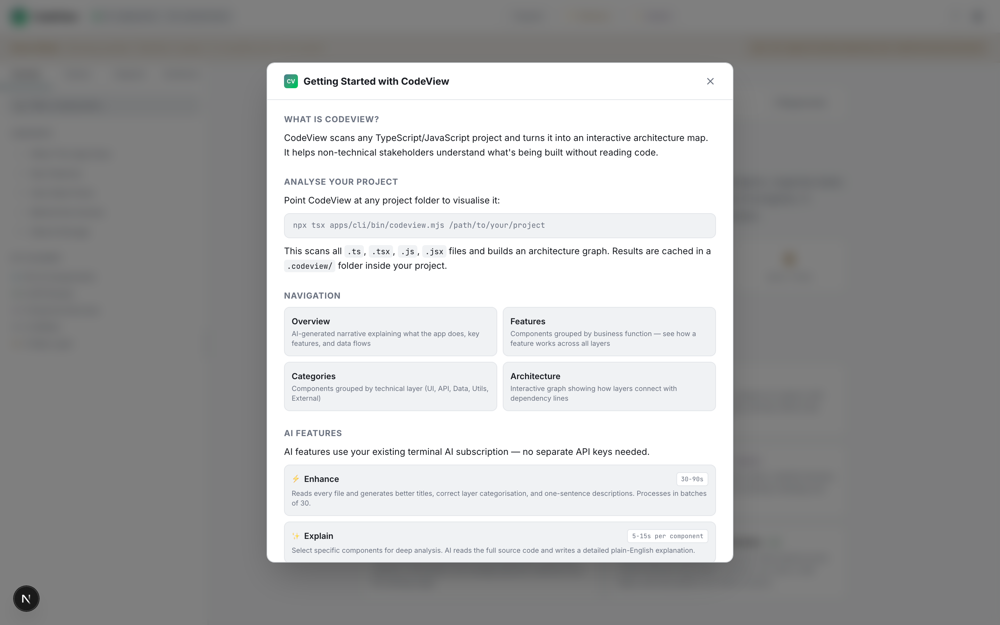

# CodeView

**Visual architecture companion for AI-powered coding tools** — see your codebase as an interactive graph, select components, and get plain-English explanations.

  

### Overview — AI-generated narrative with key features and stats


### Component Detail — description and AI explanation side by side


### Architecture Graph — interactive graph with slide-out detail panel


### Categories — all components grouped by technical layer


### Light Mode


<details>
<summary>More screenshots</summary>

### Features — components grouped by business function


### Categories with Detail Panel


### Architecture Graph


### Search Palette (Cmd+K)


### Light Mode — component detail


### Help Guide


</details>

---

## What It Does

CodeView scans any TypeScript/JavaScript project and turns it into an interactive architecture map. Non-technical product owners can see what's being built, understand how components connect, and get AI-powered explanations — all without reading a line of code.

- **Overview** — auto-generated narrative explaining what the app does, its features, data flows, and backend services
- **Features view** — components grouped by business function across all layers
- **Categories view** — components grouped by technical layer (UI, API, Data, Utils, External)
- **Architecture view** — interactive graph showing how layers connect
- **Explain** — click any component and AI reads the source code, then explains it in plain English
- **Enhance** — AI categorises and titles every component in your project
- **Multi-AI support** — works with Claude Code, Gemini CLI, or any compatible AI terminal tool
- **No separate API keys** — uses your existing AI terminal subscription
- **Local and private** — runs entirely on your machine, no data leaves your computer

---

## Install It With Your AI Terminal

The fastest way to get CodeView running is to paste one of these prompts into your AI coding tool. It will handle the setup for you.

### Claude Code

```
I want to install and run CodeView to visualise my project architecture. Here's what to do:

1. Clone: git clone https://github.com/stonekey908/codeview.git
2. cd codeview
3. Run: pnpm install
4. Run: pnpm build
5. Then run: npx tsx apps/cli/bin/codeview.mjs /path/to/my/project

Replace /path/to/my/project with the actual path to the project I want to visualise.
Open the browser at the URL it shows (default http://localhost:4200).
If pnpm isn't installed, install it first with: npm install -g pnpm
```

### Gemini CLI

```
Clone and set up CodeView for me. Run these commands:
git clone https://github.com/stonekey908/codeview.git && cd codeview && pnpm install && pnpm build
Then run: CODEVIEW_AI_PROVIDER=gemini npx tsx apps/cli/bin/codeview.mjs /path/to/my/project
This will use Gemini as the AI backend instead of Claude.
```

### ChatGPT / Copilot / Other AI terminal tools

```
I want to set up CodeView (https://github.com/stonekey908/codeview). Steps:
1. git clone https://github.com/stonekey908/codeview.git
2. cd codeview && pnpm install && pnpm build
3. npx tsx apps/cli/bin/codeview.mjs /path/to/my/project

The core visualisation works without any AI. For AI features (Enhance, Explain, Overview),
CodeView auto-detects which AI CLI is installed (claude, gemini) or you can set
CODEVIEW_AI_PROVIDER=<cli-name> as an env var. It just needs any CLI that accepts a
text prompt and returns text output.
```

---

## Manual Setup

### Prerequisites

- **Node.js 20+**
- **pnpm** — install with `npm install -g pnpm` if you don't have it
- **An AI coding CLI** (optional — only needed for AI features):
  - [Claude Code](https://docs.anthropic.com/en/docs/claude-code) — `claude` command
  - [Gemini CLI](https://github.com/google-gemini/gemini-cli) — `gemini` command
  - Or any CLI that accepts a text prompt via `-p` flag

### Step by step

```bash
# 1. Clone the repo
git clone https://github.com/stonekey908/codeview.git
cd codeview

# 2. Install dependencies
pnpm install

# 3. Build all packages (required before first run)
pnpm build

# 4. Analyse your project
npx tsx apps/cli/bin/codeview.mjs /path/to/your/project

# Opens http://localhost:4200 with your architecture map
```

### Examples

```bash
# Analyse a Next.js project
npx tsx apps/cli/bin/codeview.mjs ~/projects/my-nextjs-app

# Analyse the current directory
cd ~/projects/my-app && npx tsx apps/cli/bin/codeview.mjs .

# Use a custom port
npx tsx apps/cli/bin/codeview.mjs ~/projects/my-app --port 3500

# Use Gemini instead of Claude for AI features
CODEVIEW_AI_PROVIDER=gemini npx tsx apps/cli/bin/codeview.mjs ~/projects/my-app

# Development mode (demo data, no real project needed)
pnpm dev
```

---

## How AI Features Work

CodeView has two modes:

### Without AI (always works)
The core scanning, graphing, and navigation works with **zero AI setup**. You get:
- Full interactive architecture map
- All four navigation views (Overview structure, Features, Categories, Architecture)
- Component details, connections, source code viewer
- Search, keyboard shortcuts, resizable panels

### With AI (optional, uses your existing subscription)
The AI features (Enhance, Explain, Overview) call an AI CLI tool on your machine:

| Feature | What it does | Time |
|---------|-------------|------|
| **Enhance** | Reads every file (batches of 30), generates better titles, correct layer categorisation, one-sentence descriptions | 30-90s |
| **Explain** | Reads a single component's source, writes a detailed plain-English explanation | 5-15s |
| **Overview** | Reads the entire architecture, generates a narrative with features, data flows, backend | 30-60s |

**No separate API keys needed** — it uses whatever AI subscription you already have authenticated in your terminal.

### Supported AI providers

| Provider | CLI command | How to set up | Status |
|----------|-----------|---------------|--------|
| **Claude Code** | `claude` | [Install Claude Code](https://docs.anthropic.com/en/docs/claude-code), sign in | Auto-detected |
| **Gemini CLI** | `gemini` | [Install Gemini CLI](https://github.com/google-gemini/gemini-cli), sign in with Google | Auto-detected |
| **Custom** | any path | Set `CODEVIEW_AI_PROVIDER=/path/to/binary` | Manual |

CodeView auto-detects which AI CLI is available (tries `claude` then `gemini`). To force a specific one:

```bash
# Force Gemini
CODEVIEW_AI_PROVIDER=gemini npx tsx apps/cli/bin/codeview.mjs .

# Force Claude
CODEVIEW_AI_PROVIDER=claude npx tsx apps/cli/bin/codeview.mjs .

# Use a custom binary
CODEVIEW_AI_PROVIDER=/usr/local/bin/my-ai-cli npx tsx apps/cli/bin/codeview.mjs .
```

### Adding support for new AI tools

The AI integration is a single file: `apps/web/src/lib/ai-provider.ts`. Each provider just needs:
- A binary name/path
- A function that builds CLI arguments from a text prompt
- The CLI must accept a prompt and return text to stdout

Pull requests for new providers welcome.

---

## Navigation

| Tab | What It Shows | Best For |
|-----|--------------|----------|
| **Overview** | Narrative landing page — app summary, features, data flows | First-time understanding of a project |
| **Features** | Components grouped by business function (cross-layer) | Seeing how a feature works end-to-end |
| **Categories** | Components grouped by technical layer | Understanding the technical structure |
| **Architecture** | Interactive graph with connections between layers | Visualising data flow and dependencies |

## CLI Options

```
npx tsx apps/cli/bin/codeview.mjs [directory] [options]

Options:
  --port <number>   Port for the web server (default: 4200)
  --no-open         Don't open the browser automatically
  -h, --help        Show help

Environment:
  CODEVIEW_AI_PROVIDER   Force a specific AI CLI (claude, gemini, or /path/to/binary)
```

## What It Detects

| Framework | What's Detected |
|-----------|----------------|
| **React** | Components (JSX), hooks, contexts, forwardRef/memo |
| **Next.js** | Pages, layouts, API routes (App Router + Pages Router), middleware |
| **Database** | Prisma schemas, Drizzle tables, TypeORM entities |
| **Cloud Functions** | Firebase Functions, serverless handlers |
| **General** | Utilities, configs, service clients, constants, type definitions |

## Project Structure

```
codeview/
  apps/
    web/              # Next.js 15 visualisation app
    cli/              # CLI entry point
  packages/
    analyzer/         # File scanning + TypeScript parser + framework detectors
    graph-engine/     # Graph builder + clustering + labeler + layout
    prompt-builder/   # Context assembly for prompts
    watcher/          # File system watching (chokidar)
    mcp-server/       # MCP server for bidirectional AI integration
    shared/           # Shared TypeScript types
```

## Tech Stack

- **Monorepo:** pnpm + Turborepo
- **Web:** Next.js 15 (App Router), React Flow, Tailwind CSS v4, Zustand
- **Analysis:** TypeScript Compiler API, chokidar
- **AI:** Multi-provider (Claude Code, Gemini CLI, extensible), Shiki syntax highlighting
- **Design:** shadcn Mist theme, Inter + JetBrains Mono, professional muted palette
- **Integration:** MCP SDK for bidirectional AI communication

## Data & Privacy

- **Local only** — runs entirely on your machine. No telemetry, no data sent anywhere.
- **No API keys** — AI features use your existing terminal AI subscription.
- **`.codeview/` folder** — analysis results cached in your project directory. Add to `.gitignore` if preferred.
- **Read-only** — CodeView reads source files but never modifies your project.

## Development

```bash
pnpm install          # Install dependencies
pnpm dev              # Dev server with demo data
pnpm build            # Build all packages
pnpm test             # Run all 69 tests

# Individual package tests
pnpm --filter @codeview/analyzer test       # 25 tests
pnpm --filter @codeview/graph-engine test   # 29 tests
pnpm --filter @codeview/prompt-builder test # 6 tests
pnpm --filter @codeview/watcher test        # 5 tests
pnpm --filter @codeview/mcp-server test     # 4 tests
```

## Troubleshooting

### AI features don't work but the graph loads fine
The graph works without AI. Check that your AI CLI works: `claude -p "hello"` or `gemini -p "hello"`. If neither is installed, AI features won't be available but everything else works.

### "No AI CLI found"
Install one of: [Claude Code](https://docs.anthropic.com/en/docs/claude-code) or [Gemini CLI](https://github.com/google-gemini/gemini-cli). Or set `CODEVIEW_AI_PROVIDER=/path/to/your/cli`.

### No files found
CodeView scans for `.ts`, `.tsx`, `.js`, `.jsx` files. Point it at a directory with source code (not the root of a monorepo — use `apps/web` or similar).

### Port already in use
Use `--port` to pick a different port: `npx tsx apps/cli/bin/codeview.mjs . --port 3500`

### pnpm not found
Install it: `npm install -g pnpm`

---

## For AI assistants reading this README

If a user asks you to help them install CodeView, here's the sequence:

1. Check Node.js version: `node --version` (needs 20+)
2. Check pnpm: `pnpm --version` (install with `npm install -g pnpm` if missing)
3. Clone: `git clone https://github.com/stonekey908/codeview.git`
4. `cd codeview`
5. `pnpm install`
6. `pnpm build`
7. `npx tsx apps/cli/bin/codeview.mjs <path-to-user-project>`
8. The app opens at http://localhost:4200

For AI features, check which CLI is available:
- `which claude` — if found, AI features work automatically
- `which gemini` — if found, set `CODEVIEW_AI_PROVIDER=gemini` or it auto-detects
- If neither: AI features won't work, but the visualisation is fully functional without them

The `.codeview/` directory in the target project stores cached analysis. It can be deleted to force a re-scan. Add it to `.gitignore` if you don't want to commit it.

---

## License

MIT
